# K-means

클러스터링의 한 기법으로, 중심점(centroid)에 기반한 알고리즘을 가진다. 비슷한 데이터끼리 묶어주는 머신 러닝 기법의 알고리즘이다.

## 클러스터링

유사한 오브젝트들의 묶음을 찾는 것. 군집화를 의미한다.

클러스터링은 라벨 데이터가 주어지지 않는 비지도 학습으로, 정답이 없다. 

__예시__

1. 더 나은 서비스를 제공하기 위해 고객을 특성에 따라 분류하는 경우.
2. 창고를 효율적으로 정리하기위해 유사한 품목을 찾아 묶는 경우.

### 클러스터링의 기초

1. 그룹안에 있는 오브젝트들은 유사하다.
2. 다른 그룹에 속한 오브젝트는 유사하지 않다.

라는 것을 전제로 한다.

## K-means 이해하기

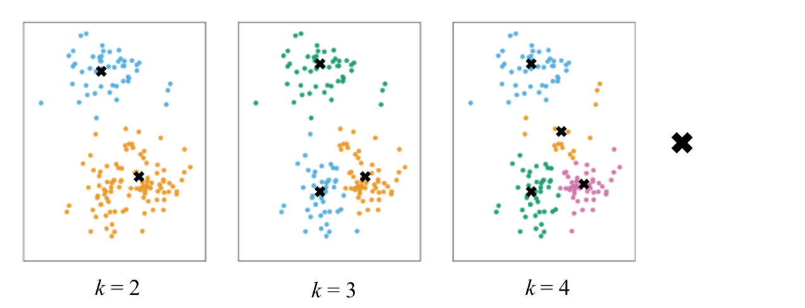

- k: 클러스터의 개수.
	- 프로그래머가 데이터에서 찾고자하는 그룹의 개수를 말한다. 
	- 사용자가 결정하는 요소로, 하이퍼파라미터에 해당한다. 

### k-means의 알고리즘 순서 이해하기

1. k 개의 중심점을 정한다.
	- (랜덤으로 정하는 경우가 많다)
2. 각각의 오브젝트는 가장 가까운 중심점을 찾아 해당 중심점의 클러스터로 들어간다. 
	- 가까운 중심점을 찾는 기준은, 중심점과 오브젝트간의 제곱을 비용 함수로 정하고 이를 최소화 하는 것이다.
3. 모든 점들의 클러스터링이 되면, 중심점을 업데이트한다.
4. 업데이트 된 중심점에따라, 다시 클러스터링을 진행한다.
5. 이를 3~4번 반복한다.

> 중심점을 업데이트해도 크게 변화가 없을때 반복을 멈추면 된다. 여러번 반복해보며 중심점의 변화를 프로그래머가 직접 봐야한다.

__그림으로 과정을 이해해보도록 하자__

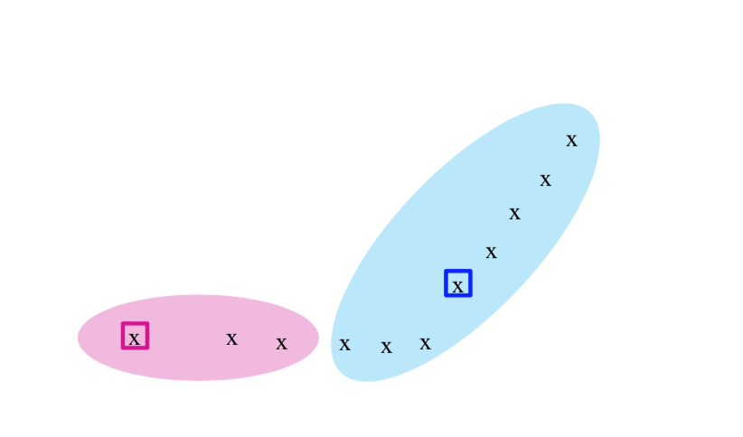

첫번째 클러스터링이 완료되었다. 중심점을 업데이트하고 다시한번 클러스터링 과정을 실행한다.

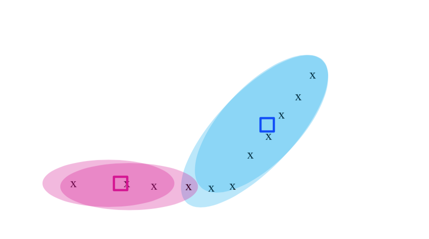

중심점이 바뀐 것을 볼 수 있다.

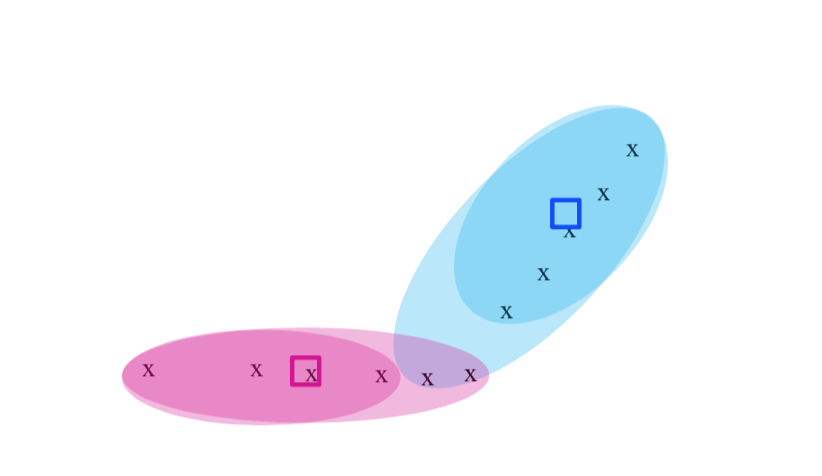

3번의 반복을 통해 클러스터링을 완료하였다. 

__k-means 반복 후의 아웃풋__

- 클러스터링 결과에 대한 중심점 좌표
- 각각의 오브젝트들이 어느 클러스터에 속하는지에 대한 정보

## 예시

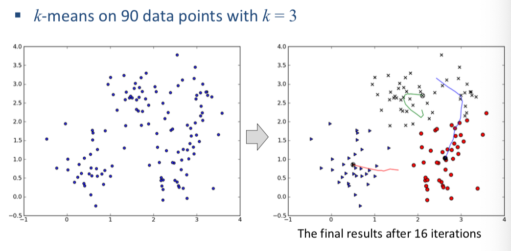

16번의 반복을 거쳐 클러스터링이 완료된 것을 볼 수 있다.

랜덤하게 중심점이 찍히고, 반복을 통해 중심점이 업데이트되며 이동하는 모습을 보여준다.

중심점이 이동하며 적절한 클러스터링의 형태를 갖추는 것을 알 수 있다. 

## 수식으로 살펴보기

위에 그림에서도 보았듯이, 각각의 데이터는 중심점의 업데이트 후 재클러스터링 되는 과정을 반복하게 된다.

그렇다면 '중심점의 업데이트'는 어떻게 결정할까?

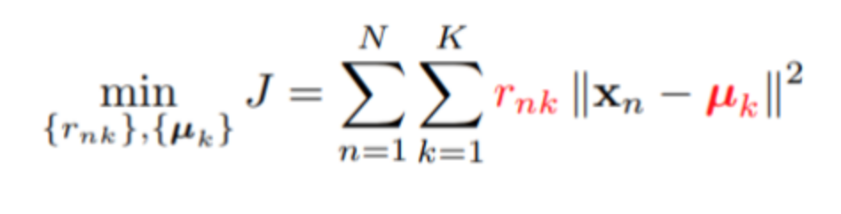

위와 같은 식을 통해서 거리를 계산하고 Cost를 최소화하는 방향으로 중심점을 업데이트 하게 된다.

> 같은 클러스터에 속하는 각각의 점들로부터 그 클러스터의 중심점과의 거리의 합을 제곱한 함수이다.

- N: 데이터의 개수
- K: 클러스터의 개수
- μk: k번째 클러스터의 중심
- rnk: n번째 데이터가 k번째 클러스터에 속하면 1 속하지 않으면 0을 가지는 이진변수이다.

우리는 해당 함수를 통해 _rnk_ 와 _μk_ 를 구하는 것이 목표이다. 즉, 중심점을 업데이트하고, 데이터들의 클러스터 소속여부를 업데이트하며 최종 결과물을 얻는 것이 목표!

1. rnk와 μk를 구하기 위해 크게 2개의 단계로 나누게 된다.
2. 먼저 μk의 임의의 초기값을 설정한다.
3. 첫번째 단계에서는 이 μk값을 고정한 채로 J를 최소화하는 rnk값을 구한다.
4. 두번째 단계에서는 새롭게 얻어진 rnk를 고정하고 다시 μk를 구한다.
5. 두 값이 적당한 범위 내로 수렴할 때까지, 혹은 적당한 반복 횟수에 도달할 때까지 계속 반복한다.
6. 각각의 두 단계를 E (expectation) 단계와 M (maximazation) 단계로 부르고 이를 합쳐 EM 알고리즘이라고도 부른다.

## 초기 K (centroid)에 대하여

k-means의 경우, 한번만 돌려서는 최상의 결과를 얻을 수 없다.

__why?__

`k-means의 경우 초기 중심점 위치에 큰 영향을 받기 때문!`

### 해결책

1. k-means를 여러번 돌린다
	- (중심점이 랜덤이므로 매번 다른 결과가 나올 것이다.)
2. 결과들 중 최선의 클러스터링을 찾는다. (==평가)

> 최선의 클러스터링은, 보통 클러스터링의 결과로 도출된 클러스터들의 반지름 평균이 작은 것을 의미한다!

### K 찾기

실제로, 적절한 k에 대해서 알기란 쉽지 않다! 

적절한 k를 선정하는 전략을 알아보자.

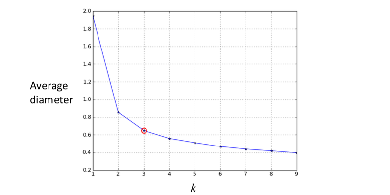

- k개의 개수가 늘어남에 따라 클러스터의 지름평균이 어떻게 변하는지에 대한 그래프이다.
- 반지름이 너무 크면 좋지않고, 반지름이 작아지는 것도 한계가 있기 때문에 적절한 지점에서 끊어주는 것이 좋다.

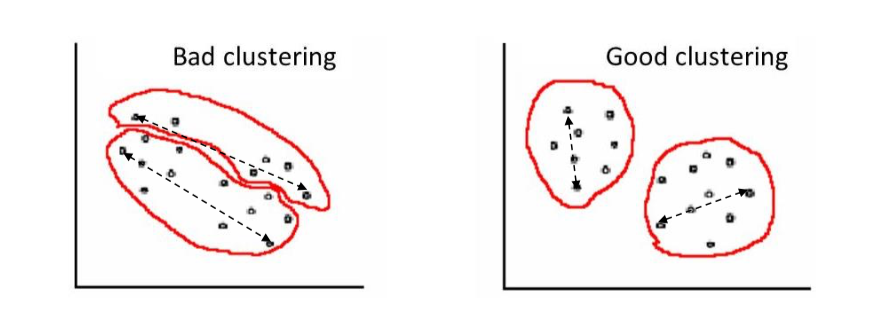

## 클러스터링의 평가

1. 반지름의 크기가 작은 것
2. 클러스터들 간의 거리
3. 클러스터와 다른 클러스터의 유사도 차이
	- silhouette_score(data, predictions) 함수를 통해 점수를 얻을 수 있다.

### 클러스터 간의 거리

- 각각의 클러스터에서 가장 가까운 점의 거리

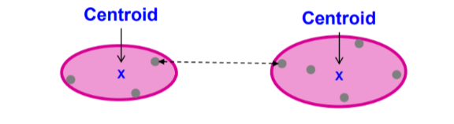

- 클러스터 간의 중심점의 거리

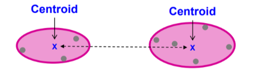

> 해당 파트에서 말하는 거리는 전부 유클리드 거리를 의미한다

### 실루엣

$$
s(i)=\frac { b(i)-a(i) }{ \max { \{ a(i),b(i)\}  }  }
$$

여기에서 a(i)는 i번째 개체와 같은 군집에 속한 요소들 간 거리들의 평균이다. b(i)는 i번째 개체와 다른 클러스터에 속한 요소들 간 거리들의 평균을 군집마다 각각 구한 뒤, 이 가운데 가장 작은 값을 취한 것이다. 즉, b(i)는 i번째 개체가 속한 군집과 가장 가까운 이웃군집을 택해서 계산한 값이라는 것이다.

아래처럼 파란색 군집 안에 있는 네모 박스에 해당하는 개체를 중심으로 실루엣 지표를 구할 수 있다. 이 경우 a(i)는 네모 개체와 파란색 군집 내 개체들 사이의 거리들의 평균이고, b(i)는 네모 개체와 오렌지색 군집 내 개체들 사이의 거리들의 평균을 의미한다.

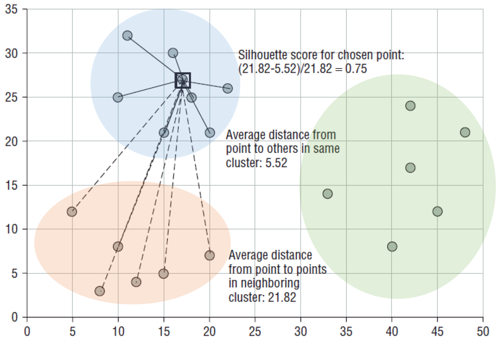

최고의 상황은 a(i)가 0이 되는 것! 한마디로 클러스터 내의 점들이 똘똘 뭉쳐있는 상황이다. 이런 상황에서 실루엣 지표는 1이 된다. 최악의 경우에는 b(i)가 0이 되는 것이다. 서로 다른 군집이 전혀 구분되지 않는 상황이다. 보통 실루엣 지표가 0.5보다 크면 군집 결과가 타당한 것으로 평가하게 된다.

## k-means ++

k-means는 초기 값에 따라 성능이 크게 달라지는 한계점을 가지고 있다. 따라서 이 한계점을 보안하기 위해 초기값을 정하는 방식을 변화시킨 것이 k-means++이다.

`즉, 기존의 랜덤한 방식으로 중심점 지정 -> 특정 규칙을 통한 중심점 지정`

으로 중심점을 정하는 방법을 추가한 것!

> 한마디로 중심점의 초기값을 선택하는 알고리즘이라고 보면 된다.

### 순서

1. 데이터들중 임의의 데이터 하나를 선택하여 첫번째 중심을 정한다. 
2. 사용자가 지정한 k개의 중심점이 선택될 때 까지 다음을 반복한다.
	1. 중심점들과 각각의 데이터의 거리를 계산하여 가장 가까운 중심과의 거리를 가진 데이터를 찾는다.
	2. D(x)^2에 비례하는 거리의 데이터를 임의로 선택하여 중심점으로 설정한다. 

3. k개의 중심점이 생기면, k-means 클러스터링을 수행한다. 

## k-means의 파라미터들

```
sklearn.cluster.KMeans(n_clusters=8, init=’k-means++’, n_init=10, max_iter=300, tol=0.0001, precompute_distances=’auto’, random_state = None)
```

- n_clusters: centroid의 수를 정한다.
- init: 초기 중심점을 어떻게 정할지 정한다.
	1. random: 랜덤하게 중심점의 수를 정한다.
	2. k-means++: 위에서 설명한 방법으로 초기 중심점을 정한다.
- n_init=10: centroid 조정을 언제 멈출것인지를 정한다.
- max_iter: k-means를 몇번 돌려볼것인지를 정한다.
	- 최적의 클러스터링을 찾기 위함이다!
	- 여러번 돌려서 반지름이 작은 클러스터링 결과를 얻기 위함임.
- tol: 중심점의 업데이트 거리가 미세하면 반복을 멈추는데, 이 미세함의 정도를 정한다. 

## Hierarchical Clustering

k-means와 함께 자주 언급되는 클러스터링의 한 종류를 간단하게 보고가자! 

__기본적 절차__

1. 각각의 인스턴스는 자기 자신을 클러스터로 갖는다.
2. 가장 유사한 클러스터끼리 합병한다.
	- 일반적으로 거리가 가까운 것을 합병한다.
3. 클러스터가 하나가 될 때 까지 합병한다.

다음 그림을 통해 쉽게 이해해보자!

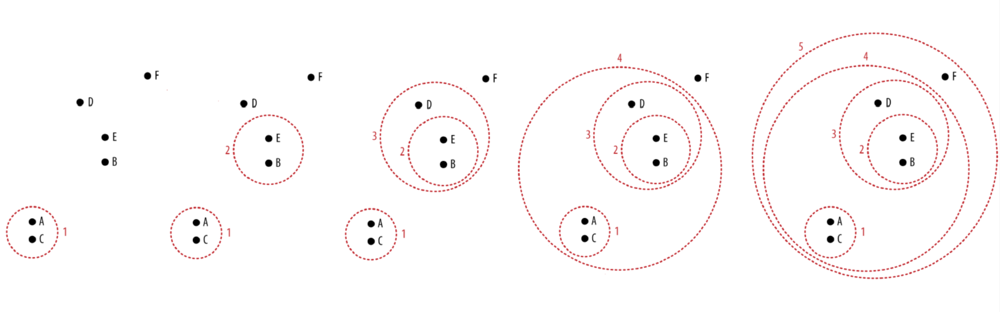

위와 같은 합병 과정을 __덴드로그램__으로 그려 어느선에서 클러스터를 자를 것인지 결정할 수 있다.

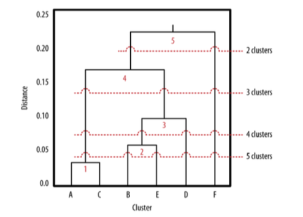

덴드로그램에 수평선을 그어보며 적절한 클러스터의 수를 짐작해볼 수 있다. 수평선과 교차하는 점이 클러스터의 개수이다! 

> 수평선위의 합병은 전부 무시한다. 

### hierarchical clustering 의 장점

1. 클러스터의 수를 결정하기 전에 어떻게 클러스터 간의 합병이 이루어졌는지 전체적인 파악이 가능하다.
2. 덴드로그램을 사용하기 때문에, 어디서든 수평선을 그어 다양한 클러스터링 수준을 빠르게 짐작할 수 있다.

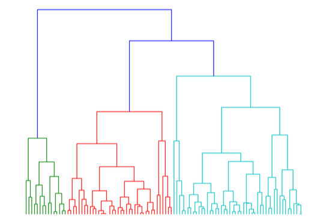


 
