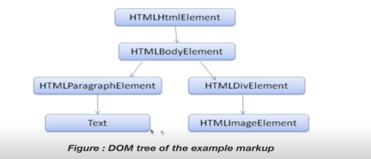

# browser

## 브라우저의 동작

서버에서 전송한 데이터가 도착해야할 곳은 `Browser`이다.

브라우저에는 데이터를 해석해주는 **parser**와 데이터를 화면에 보여주는 **렌더링 엔진이 포함되어있다.

## 브라우저의 구성

- UI
- Browser 엔진
  - 소스코드를 실행해서 화면에 보여준다.
  - 브라우저 소프트웨어를 동작시켜주는 핵심 엔진이라고 생각하자.
- 렌더링 엔진
  - 화면에 위치를 잡고 픽셀 단위로 그려주며, 브라우저별로 다르다.
  - HTML을 파싱하는 것으로 시작하는데, HTML이 가진 의미를 하나하나 파악하는 과정이다.
  - 트리구조의 형태로 HTML을 가진다. 이를 통해 렌더 트리를 생성한다.
  - 렌더트리의 스타일 정보(CSS)와 구조를 합쳐 매칭한다.

- Data persistence
  - 일부 데이터를 캐시하고 저장하는데 사용한다.
- Networking
  - 서버와 통신하는 부분!
  - 브라우저가 HTTP를 통해서 통신을 한 후, 특정 인터넷 주소를 해석 한 후 통신한다.
- Javascript 인터프리터
  - js 코드를 해석한다.

## 일반적인 파싱의 방법

`2+3-1`이라는 수식이 있을 때, operator와 operand를 분리하여 트리형태로 만든다.

이를 Syntax tree라고 하며 하나하나를 `Token`이라고 한다.

토큰 단위로 해석을 진행하면서 연산자가 나오는 경우 계산을 하나하나 합쳐가며 결과를 계산해낸다.

### HTML Parser

HTML은 어떻게 실제 브라우저에 보관이 될까?

- HTML 태그
  - HTML 내의 body 태그
    - body 태그 내의 div 태그
    - ...

위와 같은 형식으로 태그들이 트리구조로 저장이된다.

이를 `DOM Tree`라 부른다.

> CSS 또한 CSS의 룰에 따라 트리구조로 저장이 된다.

